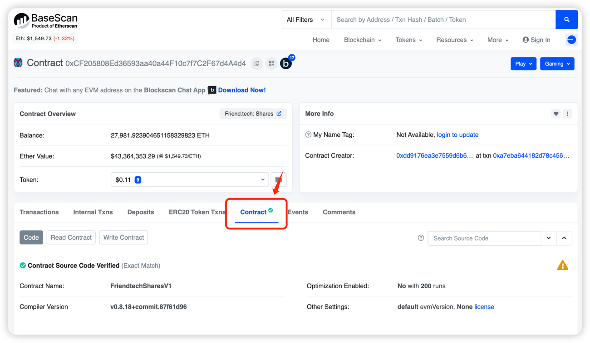
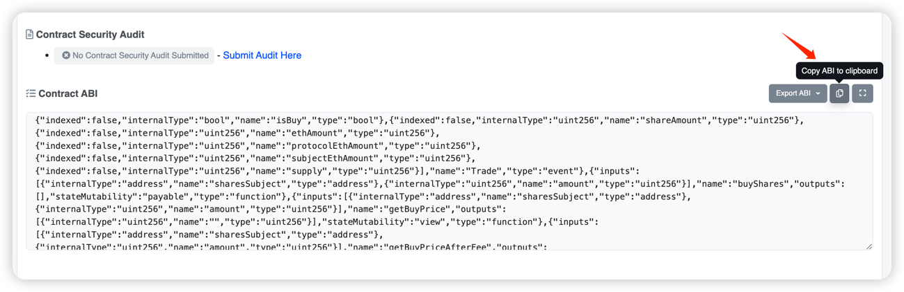
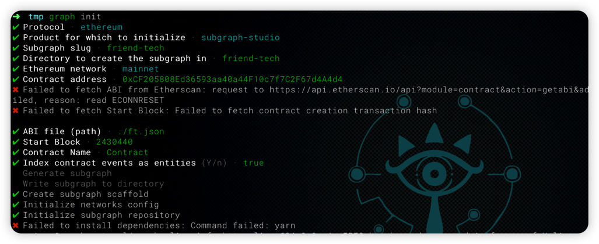
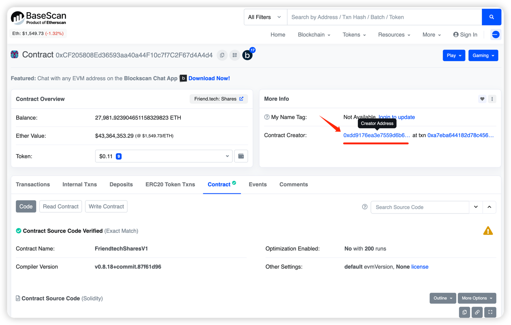
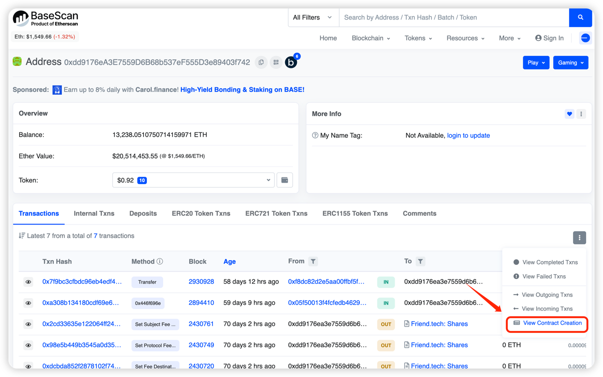
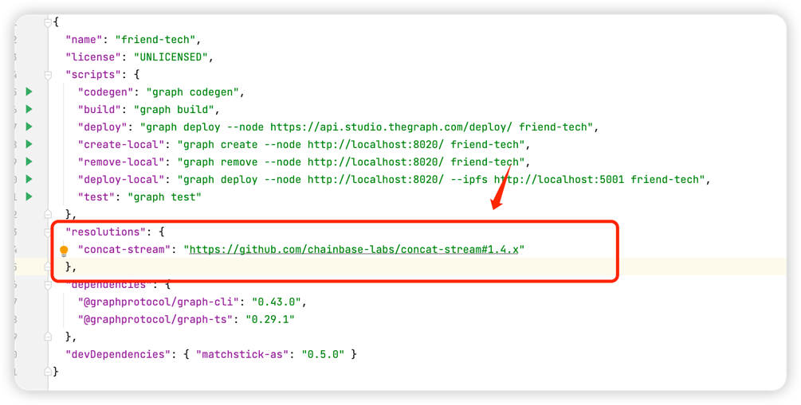
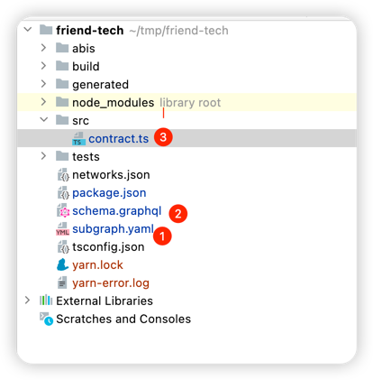
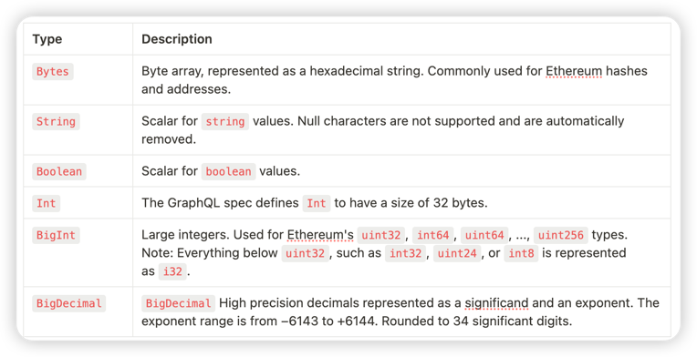
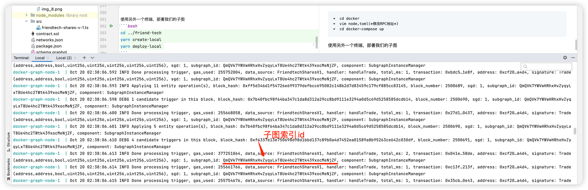
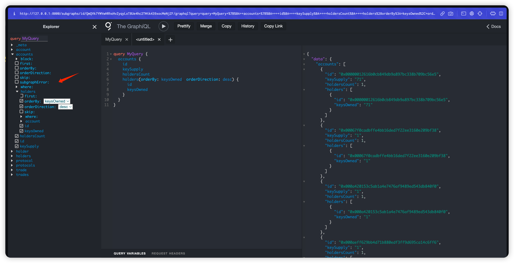

# Friend Tech subgraph Development

---
Friend Tech Project Information
- Project Name: Friend Tech
- Description Project: Friend Tech is a decentralized social platform that allows users to tokenize themselves.
- Public Chain: Base
- Contract: 0xCF205808Ed36593aa40a44F10c7f7C2F67d4A4d4
- Website: https://www.friend.tech

### I. Installing dependencies

```bash
yarn add @graphprotocol/graph-cli
yarn add @graphprotocol/graph-ts
```

### 2. Subgraph creation
### 2.1 Downloading the contract abi file
First of all, we can manually download the contract ABI file locally to speed up the creation process, contract ABI address: https://basescan.org/address/0xCF205808Ed36593aa40a44F10c7f7C2F67d4A4d4#code
Write the contents of the abi file to ft.json file.


```bash
➜ cd tmp
➜ vim ft.json
➜ cat ft.json
[{"anonymous":false, "inputs":[{"indexed":true, "internalType": "address", "name": "previousOwner", "type": "address"},{"indexed":true, " internalType": "address", "name": "newOwner", "type": "address"}],
...
```

### 2.2 Initializing Subgraph Projects
First after installing the graph-cli tool, we create a new directory locally and initialize a new subgraph project in the terminal using the command graph init

The graph cli client will guide you through the creation step by step, the parameters to be customized will vary according to the client version, but are roughly as follows:
```bash
➜ tmp graph init
Protocol - ethereum
Product to initialize - subgraph-studio
Title of the subgraph - friends-tech
✔ Directory to create subgraphs - friend-tech
✔ Ethernet network - mainnet # evm-compatible public chains can choose mainnet
✔ Contract address - 0xCF205808Ed36593aa40a44F10c7f7C2F67d4A4d4 # Contract address
Failed to get ABI from Etherscan: request https://api.etherscan.io/api?module=contract&action=getabi&address=0xCF205808Ed36593aa40a44F10c7f7C2F67d4A4d4 Failed due to: read ECONNRESET
✖ Failed to fetch starting block: Failed to fetch contract creation transaction hash

✔ ABI file (path) - . /ft.json # Fill in the abi file we downloaded manually here
✔ Starting block - 2430440 # Height of the block where the contract was created
✔ Contract name - Contract
✔ Index contract events as entities (y/n) - true
  Generate Subchart
  Write the subgraph to the catalog
Create subgraph holder
Initialize network configuration
✔ Initialize subgraph library
Failed to install dependencies: command failed: yarn # There are errors reported don't just The following shows you how to fix it
``.
Get contract deployment block height


Finally, yarn or npm will install some project-specific dependencies based on the initialization process, and there may be a concat-stream github repository version that doesn't exist for a particular branch of feature/smaller, so we can use the resolutions inside package.json to redirect the problematic branch to our chainbase branch:
``json
  "solutions": {
    "concat-stream": "https://github.com/chainbase-labs/concat-stream#1.4.x"
  }, ``json "solutions": { "concat-stream": "
``


Finally, re-execute the yarn install once more to make sure the project initializes its dependencies correctly
```bash
yarn && yarn install
``

### 2.3 Writing the subgraph pattern

Once graph init is complete, the above framework code will be generated for us by default, and only a few files need to be modified to achieve the goal of indexing bayc contracts. Next, let's step by step to understand the function of each file and try to write a subgraph that can index the contract data.
1. subgraph.yaml
   The first step is to define our data source, i.e. tell the subgraph what smart contracts to index, the contract address, network, abi and some processors that will trigger the indexing.
```bash
specVersion: 0.0.5
specVersion: 0.0.5
  file: . /schema.graphql
dataSources:
  - kind: Ethernet
    Name: Contracts
    network: mainnet
    source:
      address: "0xCF205808Ed36593aa40a44F10c7f7C2F67d4A4d4"
      abi: contract
      startBlock: 2430440
    mapping:
      kind: ethereum/events
      apiVersion: 0.0.7
      language: WSM/AssemblerScript
      entity: OwnershipTransferred
        - OwnershipTransferred
        - Transactions
      abis:
        - Name: Contract
          File: . /abis/Contract.json
      eventHandlers:
        - event: trade(address,address,bool,uint256,uint256,uint256,uint256,uint256)
          Handlers: handleTrade
      File: . /src/contract.ts
``
The Graph allows us to define three kinds of handlers on the EVM chain: event handlers, call handlers and block handlers. For more details, please refer to: **[Subgraph Manifest](https://github.com/graphprotocol/graph-node/blob/master/docs/subgraph-manifest.md)**.

The core handler function here is eventHandlers, which defines how we index data from blockchain events.

- This event is triggered whenever an nft is moved from one address to another. It records the previous owner of the nft, the new owner, and the specific nft token id.
- We want to be able to record transfers from the initial block so that we can record the complete ownership history of the full BAYC NFT
- Additionally, it will be faster to query if the Transfer ID entity is marked as immutable when it is defined later on

2. schema.garphql
   The schema defines the type of data we need to store, which are the fields that will eventually be stored in postgresql, and which can be used later to customize the query statement
```bash
type Protocol @entity {
  id: ID!
  userCount: Int!
  protocolRevenue: BigDecimal!
  accountRevenue: BigDecimal!
  tradeVolume: trade volume BigDecimal!
  totalTrades: Int!
}

type Account @entity {
  id: ID!
  holdersCount: Int!
  keySupply: BigDecimal!
  holders: [holders!] ! @derivedFrom(field: "account")
}

type Holder @entity {
  id: ID!
  account: account!
  keysOwned: BigDecimal!
}

type Trade @entity {
  keysOwned: BigDecimal!
  bytes. subject: Bytes!
  subject: Bytes!
  isBuy: Boolean value!
  shareAmount: share amount BigDecimal!
  ethAmount: BigDecimal!
  protocolEthAmount: BigDecimal!
  subjectEthAmount: BigDecimal!
  supplyEthAmount: BigDecimal!
}
```
There are a few things to note here, each entity needs to have the @entity directive. There also needs to be an ID field whose unique value must apply to all entities of the same type.


3. contract.ts (friendtech-shares-v-1.ts)
   This file is our handler, which is the exact logic we use to index data from blockchain events, here we only need to focus on the handleTrade function, which will be called every time a Transfer event is triggered, and where we can define the data we need to index
```bash
import { BigDecimal, crypto, BigInt, Bytes } from '@graphprotocol/graph-ts'.
import {
    Trade as TradeEvent,
} from '... /... /... /friend-tech/generated/FriendtechSharesV1/FriendtechSharesV1'.
From '... /... /... /friend-tech/generated/schema' to import { Trade, Protocol, Account, Holder }.

function getOrCreateAccount(accountId: string): account {
    let account = Account.load(accountId)
    if (account == null) {
        account = new Account(accountId)
        account.holdersCount = 0
        account.keySupply = BigDecimal.fromString('0')
        account.save()
    }
    return account as Account
}

function getOrCreateHolder(holderId: string, account: Account): Holder {
    let holder = Holder.load(holderId)
    if (holder == null) {
        holder = new Holder(holderId)
        holder.keysOwned = BigDecimal.fromString('0')
        holder.account = account.id
        holder.save()

        // Update the number of account holders
        account.holdersCount = account.holdersCount + 1
        account.save()
    }
    Returns the holder as a holder
}

function getOrCreateProtocol(protocolId: string): protocol {
    let protocol = Protocol.load(protocolId)
    if (protocol == null) {
        protocol = new Protocol(protocolId)
        Protocol Users = 0
        protocolRevenue = BigDecimal.fromString('0')
        protocol.accountRevenue = BigDecimal.fromString('0')
        protocol.volume = BigDecimal.fromString('0')
        protocol.totalVolume = 0
        Protocol Save
    }
    return protocol as Protocol
}

export function handleTrade(event: TradeEvent): void {
    let trade = new Trade(event.transaction.hash.toHex() + "-" + event.logIndex.toString())
    trade.trader = event.params.trader
    trade.subject = event.params.subject
    trade.isBuy = event.params.isBuy
    trade.shareAmount = event.params.shareAmount.toBigDecimal()
    trade.ethAmount = event.params.ethAmount.toBigDecimal()
    trade.protocolEthAmount = event.params.protocolEthAmount.toBigDecimal()
    trade.subjectEthAmount = event.params.subjectEthAmount.toBigDecimal()
    trade.supply = event.params.supply.toBigDecimal()
    trade.save()

    let protocol = getOrCreateProtocol('1') // assume there is only one protocol
    protocol.tradeVolume = protocol.tradeVolume.plus(trade.ethAmount)
    protocol.totalTrades = protocol.totalTrades + 1
    protocol.protocolRevenue = protocol.protocolRevenue.plus(trade.protocolEthAmount)
    protocol.accountRevenue = protocol.accountRevenue.plus(trade.subjectEthAmount)
    protocol.userCount = protocol.userCount + 1 // This logic may need to be adjusted based on user-specific definitions
    Protocol saving

    let accountId = event.params.trader.toHex()
    let account = getOrCreateAccount(accountId)

    account.keySupply = account.keySupply.plus(trade.shareAmount) // assume share amount corresponds to key
    Save the account

    let holderId = event.transaction.from.toHex()
    let holder = getOrCreateHolder(holderId, account)

    holder.keysOwned = holder.keysOwned.plus(trade.shareAmount) // update the keys owned by this holder
    holder.save()
}
```

### 2.3 Compile and Build By this point, we've completed development in its entirety
At this point, we've fully developed a simple subgraph, and we can now compile our code and deploy the subgraph.

Coding the graph

Each time you modify the subgraph.yaml and scheme.graphql files, run codegen to generate the corresponding AssemblyScript files in the generated directory: ``bash
``bash
➜ friend-tech git:(main) ✗ graph codegen               
Skip migration: Upgrade apiVersion from 0.0.1 to 0.0.2.
Skip migration: Upgrade apiVersion from 0.0.2 to 0.0.3.
Skip Migration: Skip mapping apiVersion from 0.0.3 to 0.0.4.
Skip migration Skip mapping apiVersion from 0.0.4 to 0.0.5
Skip Migration Skip mapping apiVersion from 0.0.5 to 0.0.6.
Skip migration Upgrade manifest specification version from 0.0.1 to 0.0.2
Skip migration Upgrade manifest specification version from 0.0.2 to 0.0.4
✔ Application Migration
Load subgraph from subgraph.yaml
Load contract ABI from abis/Contract.json
✔ Load Contract ABI
Generate types for contract ABI: contract (abis/Contract.json)
Write the type to the generated /Contract/Contract.ts
Generate types for the Contract ABI
Generate types for data source templates
✔ Load the data source template ABI
✔ Generate types for the data source template ABI
✔ Load GraphQL schema from schema.graphql
Write types to generated /schema.ts
✔ Generate types for the GraphQL schema

Successfully generated types
```

2. Build the graph
Turn subgraph into WebAssembly and wait for deployment
```Bash
➜ friend-tech git:(main) ✗ graph build  
  Skip migration: Upgrade apiVersion from 0.0.1 to 0.0.2.
  Skip migration: skip mapping apiVersion from 0.0.2 to 0.0.3.
  Skip migration: Skip mapping apiVersion from 0.0.3 to 0.0.4.
  Skip migration Skip mapping apiVersion from 0.0.4 to 0.0.5
  Skip Migration Skip mapping apiVersion from 0.0.5 to 0.0.6.
  Skip migration Upgrade manifest specification version from 0.0.1 to 0.0.2
  Skip migration Upgrade manifest specification version from 0.0.2 to 0.0.4
✔ Application Migration
Load subgraph from subgraph.yaml
  Compile data source: Contract => build/Contract/Contract.wasm
✔ Compile the subgraph
  Copy the schema file build/schema.graphql
  Compile subgraph file build/Contract/abis/Contract.json
  Write the subgraph manifest build/subgraph.yaml
✔ Write the compiled subgraph to build/

Build is complete: build/subgraph.yaml
```

3. Deploying our subgraph
   Start our local docker instance (note that modifying the rpc address in node.toml requires an api key, if you don't have one you can go to the chainbase backend and create one).

```bash
➜ cd docker
➜ vim node.toml(* modify the RPC address*)
➜ cd docker-compose up
```
After a successful deployment, let's wait a few minutes and we should have our index data in this database
! [img.png](imgs/img_11.png)

Using another terminal, deploy our subgraphs
```bash.
cd ... /friend-tech 
yarn create-local
yarn deploy-local 
```

After a successful deployment, you can see the deployment_id of our newly deployed subgraph in the docker runtime logs

Open the graphql query window locally
http://127.0.0.1:8000/subgraphs/id/QmQVk7YWVwHRhxHvZyqyLxT8Ue4hc2TWtk439xocMeNjZF
